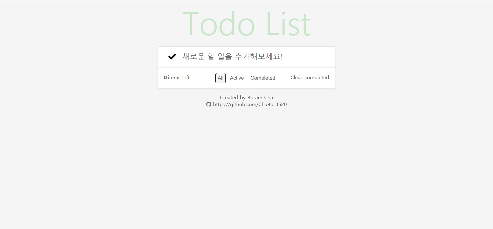

# ToDoList를 만들어보자!

## [ToDoList](https://chabo-4520.github.io/TodoList_Javascript/)

**개발기간** : 2021.06.11~12

**사용기술** : HTML, Css, JavaScript

## 목표

> HTML, CSS, Javascript를 이용하여 ToDoList를 만들어보자

## 프로젝트 계획 이유

> HTML, CSS, Javascript를 다시한번 복습하면서 이를 가장 잘 녹여낼 수 있는 주제가 TodoList라고 생각했습니다.

## 참고디자인

[https://todomvc.com/examples/vanillajs/](https://todomvc.com/examples/vanillajs/)

## 기능 설명

1. **Input**
   - Input에 할 일을 작성하고 Enter를 입력하면 아래 할 일 목록에 추가됩니다.
   - 가장 왼쪽의 ✔를 클릭하여 모든 목록의 종료 여부를 토글 할 수 있습니다.
2. **List**
   - 리스트에는 작성한 할 일 목록이 추가됩니다.
   - 각각의 목록은 우측의 ❌을 클릭하여 삭제할 수 있습니다.
   - 각각의 목록은 좌측의 ⭕를 클릭하여 완료 여부를 체크할 수 있습니다.
3. **Filter**
   - 가장 아래쪽에는 List를 필터링할 수 있는 버튼들이 있습니다.
   - All : 모든 목록을 볼 수 있습니다.
   - Active : 완료되지 않은 목록을 볼 수 있습니다.
   - Completed : 완료된 목록을 볼 수 있습니다.
4. **기타**
   - 우측하단의 Clear-completed버튼을 클릭하면 목록 중 완료된 목록 전체를 List에서 삭제할 수 있습니다.

## 업데이트 사항

- **2021.06.13**
  - **Update**
    - 헤더와 목록의 font-style을 Google font의 [Roboto](https://fonts.google.com/specimen/Roboto)로 변경
- **2021.06.16** 
  - **Refactoring**
    - filter버튼에 접근하는 메소드를 chlidnodes에서 querySelectorAll로 변경**
  - **Update**
    - List에 있는 삭제 버튼을 hover시 나타나토록 변경
- **2021.06.17**
  - **Update**
    - List에 있는 목록의 내용을 더블클릭을 이용하여 수정할 수 있도록 기능 추가

## 추가 예정

- ~~List에 있는 목록의 내용을 더블클릭을 이용하여 수정할 수 있도록 수정할 것~~
- ~~List에 있는 삭제 버튼을 hover시 나타나토록 변경할 것~~
- 목록 체크시 내용에 취소선(~~취소선~~)삽입

## 수정 할 내용

- List 내용 수정시 나타나는 input 디자인
- 목록 체크시 나타나는 이미지 디자인 수정